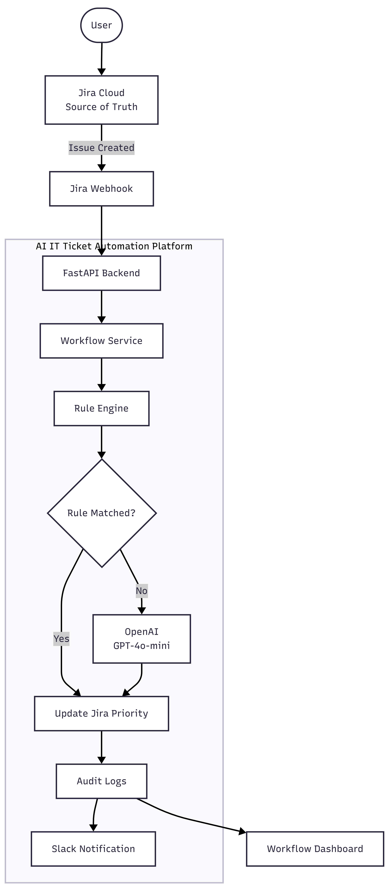
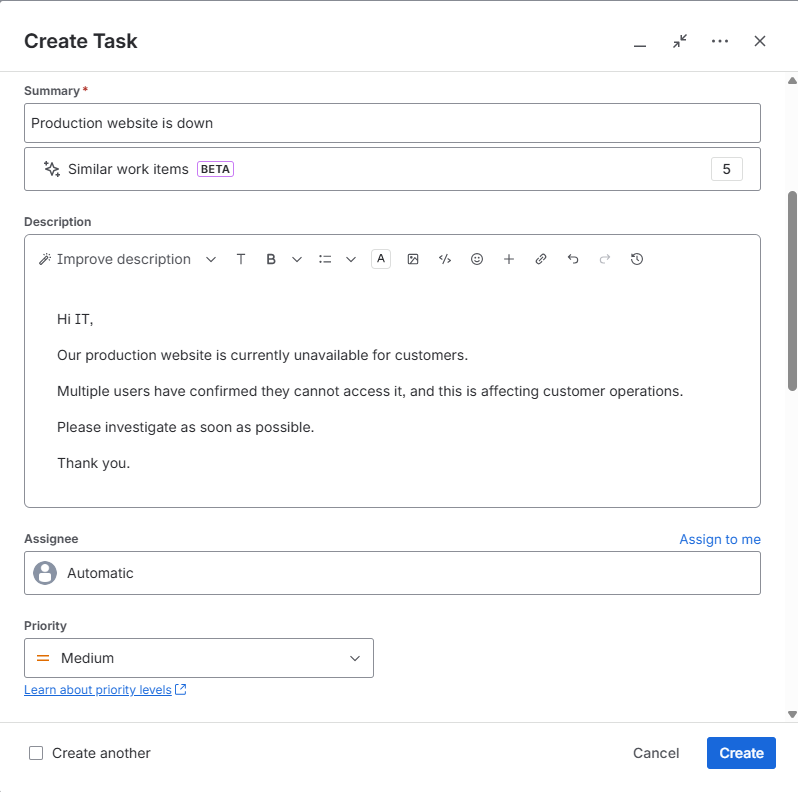
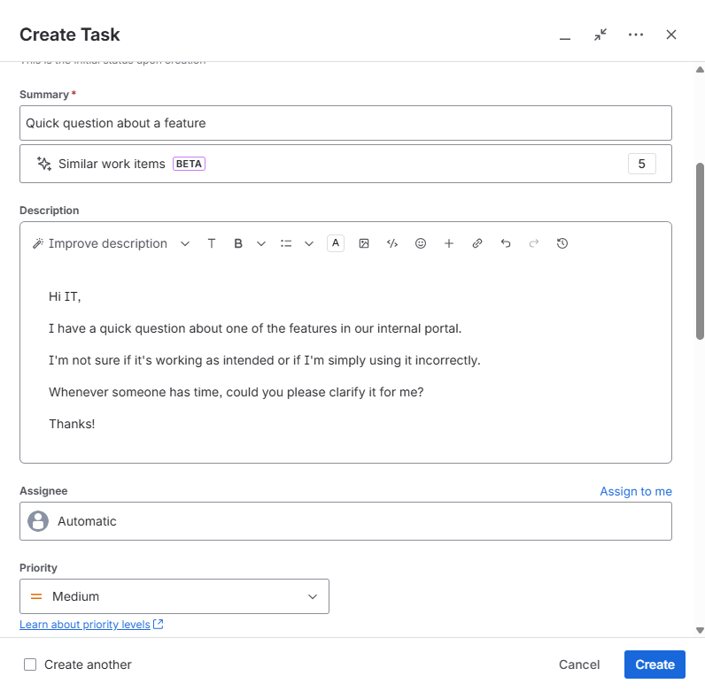
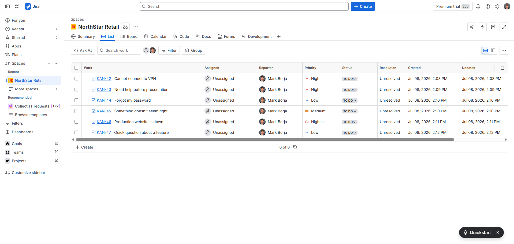
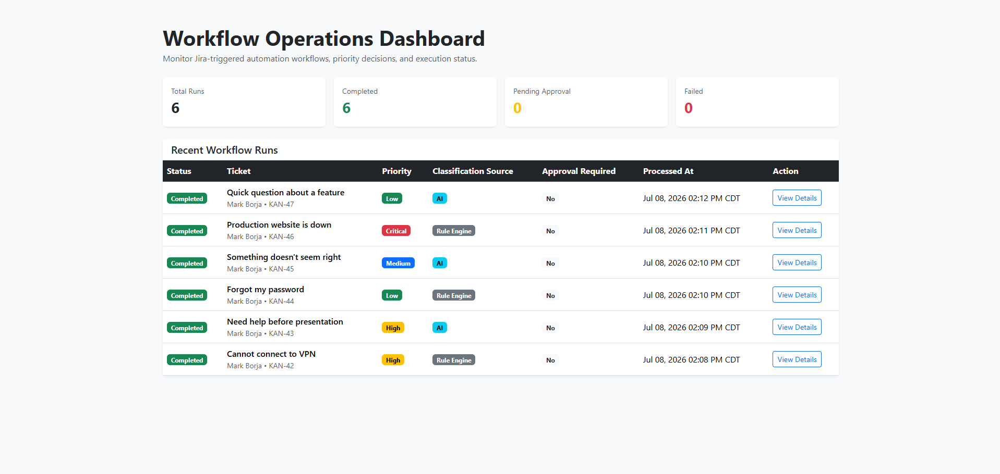
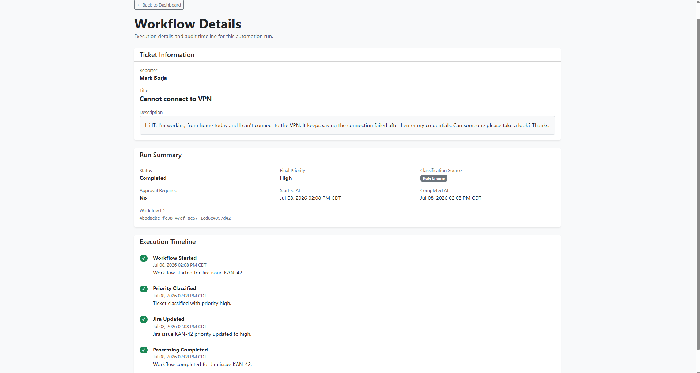
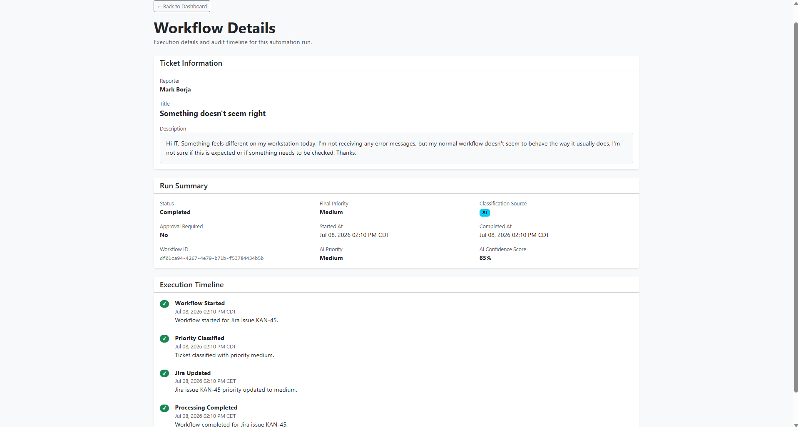
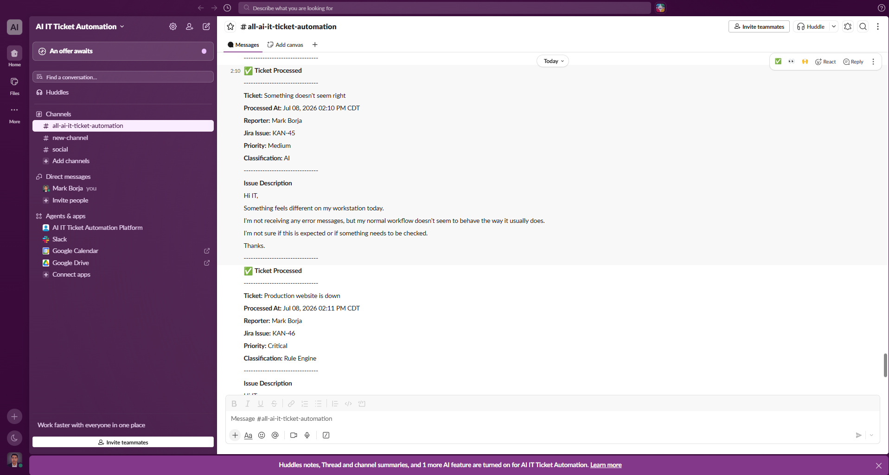

# AI IT Ticket Automation Platform


An enterprise-style IT ticket automation platform that automates IT ticket prioritization using a hybrid workflow of deterministic business rules and AI-powered classification.

Instead of sending every ticket to AI, the platform follows a **Rule Engine-first architecture**. Known ticket patterns are handled instantly using deterministic rules, while only unmatched tickets are classified using OpenAI. This approach reduces AI cost, improves response time, and reflects how enterprise automation platforms are commonly designed.

The platform integrates with Jira Cloud through webhooks, updates ticket priorities automatically, records a complete workflow audit trail, sends Slack notifications, and provides a dashboard for monitoring workflow executions.

This project demonstrates enterprise workflow automation using modern backend engineering practices, third-party integrations, and AI-assisted decision making.

---

## Getting Started

### Prerequisites

- [Docker Desktop](https://www.docker.com/products/docker-desktop/) (recommended), **or** Python 3.13 with a local PostgreSQL 16 instance
- A Jira Cloud site, a Slack incoming webhook, and an OpenAI API key, if you want the real integrations to run end-to-end. Without them, the app still boots and the dashboard/API work locally - only the actual outbound Jira/Slack/OpenAI calls will fail.

### 1. Configure environment variables

```bash
cp api/.env.example api/.env
```

Fill in `api/.env` with your own values. See [`api/.env.example`](api/.env.example) for the full list of required variables.

### 2. Run it

**Option A - Docker Compose (recommended):**

```bash
docker compose up -d --build
```

This builds the API image, starts PostgreSQL, waits for the database to report healthy, then starts the API. Confirm both containers came up correctly:

```bash
docker compose ps
```

Both `api` and `db` should show `(healthy)`, not just `Up`.

**Option B - Local development (Postgres in Docker, app running natively):**

```bash
docker compose up -d db          # Postgres only
pip install -r api/requirements-dev.txt
cd api
uvicorn app.main:app --reload --port 8000
```

Run `uvicorn` from inside `api/`, not the repository root - the app imports itself as `app.*`, so `api/` needs to be the working directory.

### 3. Verify it's running

- `GET http://localhost:8000/health` - liveness check, no dependencies
- `GET http://localhost:8000/health/ready` - confirms the database connection actually works
- `http://localhost:8000/dashboard` - the operations dashboard

---

# Demo

The animation below demonstrates the complete end-to-end workflow:

- Create a Jira ticket
- Jira webhook triggers the automation
- Rule Engine or OpenAI classifies the ticket
- Jira priority is updated automatically
- Slack notification is sent
- Workflow execution appears in the dashboard


---

# System Architecture

The platform follows a **Jira-first, Rule Engine-first** architecture designed to mirror enterprise IT automation workflows.

<p align="center">
    
</p>

---

# Screenshots

## 1. Creating a Jira Ticket (Rule Engine)

The reporter creates a Jira ticket and selects an initial priority. The submitted priority is treated as user input and is automatically evaluated by the automation platform after submission.

<p align="center">
    
</p>

---

## 2. Creating a Jira Ticket (AI Classification)

When a ticket does not match deterministic business rules, the platform delegates classification to OpenAI.

<p align="center">
    
</p>

---

## 3. Jira Project

Jira is the system of record. Every newly created issue automatically triggers the automation workflow through a Jira webhook.

<p align="center">
    
</p>

---

## 4. Workflow Operations Dashboard

The dashboard provides operational visibility into every workflow execution, including workflow status, final priority, classification source, approval state, and execution history.

<p align="center">
    
</p>

---

## 5. Rule Engine Workflow

Deterministic tickets are classified immediately using predefined business rules without invoking AI.

<p align="center">
    
</p>

---

## 6. AI Workflow

When no deterministic rule matches, OpenAI classifies the ticket priority. The workflow records the AI-generated priority, confidence score, and complete execution history.

<p align="center">
    
</p>

---

## 7. Slack Notification

After processing completes, the platform sends a formatted Slack notification containing the ticket details, final priority, classification source, and workflow completion time.

<p align="center">
    
</p>

---

## Tech Stack

### Backend

- Python 3.13
- FastAPI
- SQLAlchemy
- PostgreSQL

### Artificial Intelligence

- OpenAI API
- GPT-4o-mini

### Integrations

- Jira Cloud REST API
- Jira Webhooks
- Slack Incoming Webhooks

### Infrastructure

- Docker
- Docker Compose
- ngrok (Local Webhook Testing)

### Frontend

- Jinja2
- Bootstrap 5

---

## Key Features

### Workflow

- Jira-first workflow architecture
- Workflow execution tracking
- Audit logging for every workflow event

### Classification

- Rule Engine priority classification
- OpenAI fallback priority classification
- AI confidence score persistence

### Integrations

- Automatic Jira priority updates
- Slack workflow notifications

### Approval Workflow

- Category-based approval gate (security-sensitive change, financial/payroll access,
  software purchase) - independent of the priority classification. Urgent tickets (outages,
  executive-impact requests) are never gated, no matter how severe - see
  [project-decisions.md](docs/project-decisions.md), Decision #9
- A real pause: Jira is set to a **Pending** priority immediately, and the workflow does not
  complete until a human approves or rejects it via the API or the dashboard
- Dashboard "Pending Approvals" section with Approve/Reject actions

### Monitoring

- Dashboard for monitoring workflow runs
- Workflow details page with execution timeline

### Infrastructure

- Dockerized local development environment
- GitHub Actions CI (lint, test, dependency security scan) on every push and PR
- Pre-commit hooks (Ruff, gitleaks) and Dependabot

---

## Project Status

Both Version 1 (core platform) and Version 2 (engineering practices: automated testing,
CI/CD, security scanning, health/readiness checks, Docker hardening) are complete, plus the
approval workflow described above. See [docs/project-roadmap.md](docs/project-roadmap.md)
for the full breakdown and what's next.

### Completed

- Jira Cloud webhook integration
- Rule Engine + OpenAI fallback priority classification
- Category-based approval workflow with a real pause and Jira status sync
- Workflow tracking and audit logging
- Slack notifications
- Dashboard, including Pending Approvals
- pytest suite + CI (GitHub Actions) + pre-commit hooks + dependency scanning
- Dockerized local development with health/readiness checks

### Next

- Public deployment (see the roadmap doc)

---

## Workflow Summary

1. Jira receives a new IT support ticket.
2. Jira sends a webhook to the FastAPI application.
3. The ticket is persisted in PostgreSQL, and a WorkflowRun is created to track execution.
4. The Rule Engine attempts to classify the ticket priority; if no rule matches, OpenAI
   classifies it instead.
5. The approval policy evaluates the ticket's category (independent of its priority).
6. If approval is required: Jira's priority is set to **Pending**, a Slack notification goes
   out, and the workflow stops - the real priority is not written to Jira and the workflow
   is not complete until a human approves or rejects it.
7. If no approval is required: the classified priority is written to Jira immediately.
8. Audit logs are recorded throughout the workflow, and Slack is notified on completion,
   rejection, or failure.

---

## Running Tests

The test suite covers backend business logic, starting with the Rule Engine.

```bash
pip install -r api/requirements-dev.txt
pytest
```

Run from the repository root. `pytest.ini_options` in `pyproject.toml` adds `api/` to the
Python path so tests can import the app the same way the app imports itself.

## Development Setup

Linting and formatting run through [Ruff](https://docs.astral.sh/ruff/), configured in
`pyproject.toml`:

```bash
ruff check .
ruff format .
```

Pre-commit hooks run Ruff, a secrets scanner (gitleaks), and basic file hygiene checks
automatically on every commit:

```bash
pre-commit install
```

CI (GitHub Actions) runs the same lint and test checks on every push and pull request.

---

## Architecture & Design Decisions

### Jira-first architecture

Jira is the source of truth for tickets. The application does not create Jira tickets. Instead, it reacts to Jira webhooks, processes the ticket, and writes the result back to Jira.

This mirrors how internal enterprise automation systems usually work: automation layers enhance existing business platforms instead of replacing them.

### Rule Engine first, AI fallback second

The Rule Engine always runs before OpenAI.

Known ticket patterns are handled deterministically because rules are:

- faster
- cheaper
- easier to test
- easier to audit
- more predictable

OpenAI is only used when no rule matches. This keeps AI usage focused, controlled, and cost-efficient.

### AI only classifies priority in Version 1

Version 1 intentionally limits AI to priority classification only.

The AI returns:

```json
{
  "priority": "high",
  "confidence_score": 0.95
}
```

The confidence score is saved for audit visibility, but it does not control workflow behavior.

### WorkflowRun tracking

Every Jira webhook execution creates a WorkflowRun record.

This makes it possible to track:

- workflow status
- final priority
- classification source
- AI metadata
- start time
- completion time
- failure information

### Audit logging

Important workflow events are stored as audit logs.

This creates a traceable history of what happened during each automation run, including classification, Jira updates, workflow completion, and failures.
