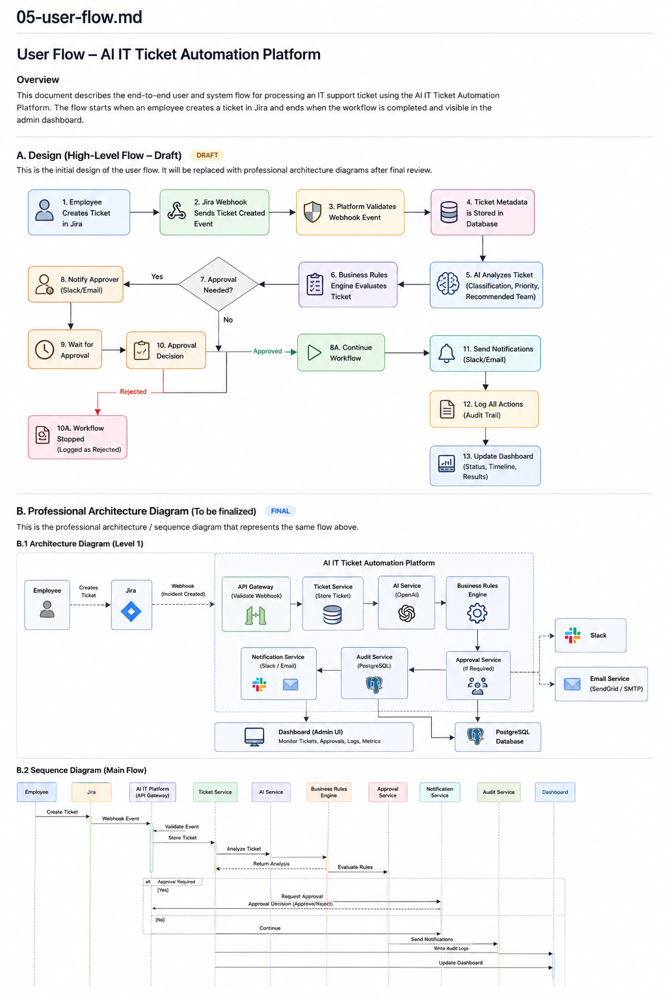

# User Flow

## Overview

This document describes the end-to-end workflow of the AI IT Ticket Automation Platform.

The workflow begins when an employee submits an IT support ticket through Jira and ends when the ticket has been analyzed, processed, audited, and made available for administrators through the platform dashboard.

The platform is designed to automate IT ticket triage while ensuring deterministic business rules always take precedence over AI recommendations. AI is only used when business rules cannot confidently classify a ticket.

---

# High-Level Workflow

---

# Workflow Steps

## Step 1 — Employee Creates Ticket

An employee submits an IT support request through Jira.

The ticket may contain:

- Title
- Description
- Reporter
- Attachments (optional)

Jira becomes the system of record for the ticket throughout its lifecycle.

---

## Step 2 — Jira Sends Webhook

When a new ticket is created, Jira sends a webhook event to the AI IT Ticket Automation Platform.

The webhook contains the ticket information required for workflow processing.

---

## Step 3 — Ticket Validation

The platform validates the incoming webhook before processing begins.

Validation includes:

- Webhook authenticity
- Required ticket fields
- Supported event type

Invalid requests are rejected and logged.

---

## Step 4 — Workflow Record Creation

The platform creates a workflow record for the incoming Jira issue.

The workflow record tracks automation activities performed by the platform and is separate from the Jira ticket itself.

Typical information includes:

- Jira Issue Key
- Workflow Status
- Processing Timestamps
- Automation State

This enables workflow monitoring and auditing without duplicating Jira's ticket data.

---

## Step 5 — Business Rules Engine

The Business Rules Engine evaluates the ticket against predefined deterministic rules.

Examples include:

- Production outage
- VPN connectivity issue
- Password reset
- Access denied
- Other known IT support scenarios

If a matching rule is found:

- The priority is assigned immediately.
- AI analysis is skipped.
- Workflow processing continues.

If no matching rule is found:

- The ticket is forwarded to the AI Classification Service.

Business rules always have the highest priority when deterministic conditions are met.

---

## Step 6 — AI Analysis (Fallback)

The AI Classification Service analyzes tickets that cannot be classified by the Business Rules Engine.

The AI may generate:

- Ticket category
- Priority recommendation
- Support team recommendation
- Missing information
- Suggested first response

The AI assists the automation workflow but is only used for ambiguous or unknown ticket types.

---

## Step 7 — Human Approval (If Required)

The Approval Policy Service evaluates ticket category against the ticket's title and
description - independently of the Rule Engine/AI priority classification. See
[project-decisions.md](project-decisions.md), Decision #9, for the full list of categories
and why they're deliberately narrow.

Examples that require approval:

- Production or business-wide outages
- Security-sensitive changes (firewall/network configuration)
- Financial or payroll system access
- Executive-impact requests
- Software purchases

If approval is required, this is a real pause, not just a flag:

- An `Approval` row is created (`pending`).
- The `WorkflowRun` status becomes `pending_approval`.
- Jira's priority is immediately set to a **Pending** workflow-state value (not the
  classified priority) so the ticket visibly reflects "awaiting approval" in Jira itself.
- A Slack notification goes out with the classified priority and the reason approval is
  required.
- Workflow execution genuinely stops here - Jira does **not** get the real classified
  priority, and the workflow does not complete, until a decision is made via
  `POST /workflow-runs/{id}/approve` or `/reject` (see
  [08-api-design.md](08-api-design.md)).

Approving resumes the workflow: Jira gets the real classified priority, and the workflow
completes normally. Rejecting sets Jira's priority to a **Rejected** workflow-state value
and the workflow ends there permanently - it does not retry or continue.

Otherwise (no approval required), processing continues automatically.

---

## Step 8 — Notifications

The platform sends Slack notifications at each meaningful workflow transition: approval
required, workflow completed, approval rejected, and processing failed. There is no email
integration in this project - see [12-security-review.md](12-security-review.md).

---

## Step 9 — Audit Logging

Every significant workflow action is recorded.

Examples include:

- Rule Engine decisions
- AI recommendations (when used)
- Human approval outcomes
- Notifications sent
- Jira integration events
- Errors
- Processing timestamps

These audit logs provide complete traceability for every automation workflow.

---

## Step 10 — Dashboard Update

The platform dashboard displays workflow information in real time.

Examples include:

- Jira Issue Key
- Workflow Status
- Current Priority
- Classification Source (Rule Engine or AI)
- Approval Status
- Processing History
- Workflow Metrics

The dashboard provides administrators with visibility into workflow execution without replacing Jira as the ticket management system.

---

# Workflow Completion

The workflow is considered complete when:

- The Jira ticket has been processed.
- Business rules have been evaluated.
- AI analysis has completed (if required).
- Required approvals have been completed.
- Notifications have been delivered.
- Audit logs have been recorded.
- Workflow records have been updated.
- The dashboard reflects the latest workflow status.
